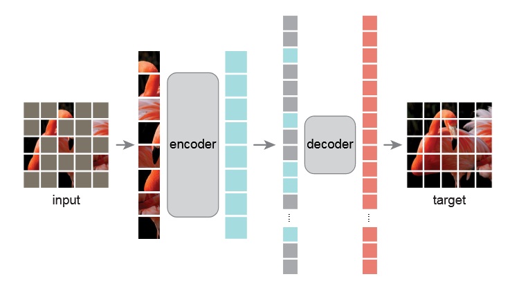

# MAE

*Masked Autoencoders*(MAE) are scalable self-supervised learners for computer vision. Inspired by BERT which removes a portion of data and learns to predict the removed content, the MAE approach is to randomly mask patches of input image and reconstruct the missing pixels. Similar to traditional autoencoder, MAE has an encoder-decoder architecture, where the encoder maps the input images after randomly masking to a latent representation and the decoder reconstructs the missing pixels from the latent representation. However, MAE applies an asymmetric design that the encoder operates only on the visible subset of the image(without mask tokens) while the decoder reconstructs the images from full information from the latent representation and mask tokens. Both the encoder and decoder of MAE are based on ViT, the first Transformer-based vision model discarding convolution entirely.

## Abstract

This paper shows that masked autoencoders (MAE) are scalable self-supervised learners for computer vision. Our MAE approach is simple: we mask random patches of the input image and reconstruct the missing pixels. It is based on two core designs. First, we develop an asymmetric encoder-decoder architecture, with an encoder that operates only on the visible subset of patches (without mask tokens), along with a lightweight decoder that reconstructs the original image from the latent representation and mask tokens. Second, we find that masking a high proportion of the input image, e.g., 75%, yields a nontrivial and meaningful self-supervisory task. Coupling these two designs enables us to train large models efficiently and effectively: we accelerate training (by 3× or more) and improve accuracy. Our scalable approach allows for learning high-capacity models that generalize well: e.g., a vanilla ViT-Huge model achieves the best accuracy (87.8%) among methods that use only ImageNet-1K data. Transfer performance in downstream tasks outperforms supervised pretraining and shows promising scaling behavior.

## Reference

[1] He, Kaiming, Xinlei Chen, Saining Xie, Yanghao Li, Piotr Dollár, and Ross Girshick. “Masked Autoencoders Are Scalable Vision Learners.” arXiv, December 19, 2021. https://doi.org/10.48550/arXiv.2111.06377.

[2] Dosovitskiy, Alexey, Lucas Beyer, Alexander Kolesnikov, Dirk Weissenborn, Xiaohua Zhai, Thomas Unterthiner, Mostafa Dehghani, et al. “An Image Is Worth 16x16 Words: Transformers for Image Recognition at Scale.” arXiv, June 3, 2021. https://doi.org/10.48550/arXiv.2010.11929.

[3] Devlin, Jacob, Ming-Wei Chang, Kenton Lee, and Kristina Toutanova. “BERT: Pre-Training of Deep Bidirectional Transformers for Language Understanding.” arXiv, May 24, 2019. https://doi.org/10.48550/arXiv.1810.04805.