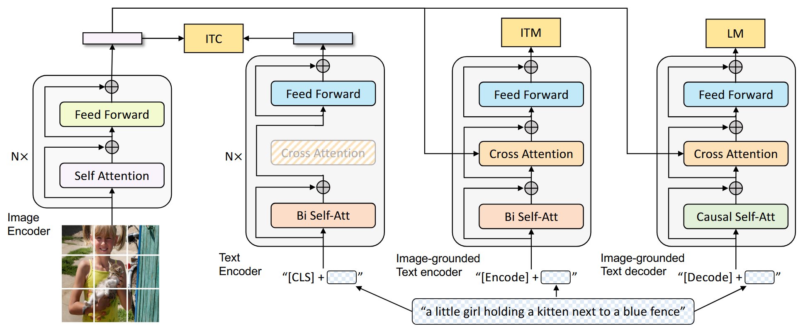
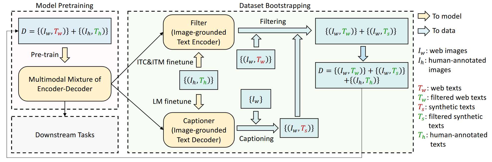

# BLIP

BLIP is a unified VLP framework for learning from noisy image-text pairs. BLIP contains a multimodal mixture of encoder-decoder(MED) for pre-training a unified model with understanding and generation capabilities.

1. **Unimodal encoder.** It takes **ViT** as an image encoder, which divides an image into patches and encodes them as a sequence of embeddings with a [CLS] token representing the global image feature, and **BERT** as a text encoder with a [CLS] token summarizing the sentence.
2. **Image-grounded text encoder.** It injects visual features through the Cross-Attention layer. It prepends a [Encode] token to the text. After text encoding, the output embedding of [Encode] is used as a multimodal representation of the image-text pair.
3. **Image-grounded text decoder**. It uses a [Decode] token to indicate the beginning of the sentence and a [EOS] token to signal its end.

BLIP is pre-trained with three vision-language objectives: image-text contrastive learning, image-text matching, and image-conditioned language modeling. Hence, it contains three losses: (1) **Image-Text Contrastive Loss** (ITC) for vision-language alignment; (2) **Image-Text Matching Loss** (ITM) for learning the multimodal representation of image-text pairs; (3) **Language Modeling Loss** (LM) for image captioning generation.

## Abstract

Vision-Language Pre-training (VLP) has advanced the performance for many vision-language tasks. However, most existing pre-trained models only excel in either understanding-based tasks or generation-based tasks. Furthermore, performance improvement has been largely achieved by scaling up the dataset with noisy image-text pairs collected from the web, which is a suboptimal source of supervision. In this paper, we propose BLIP, a new VLP framework which transfers flexibly to both vision-language understanding and generation tasks. BLIP effectively utilizes the noisy web data by bootstrapping the captions, where a captioner generates synthetic captions and a filter removes the noisy ones. We achieve state-of-the-art results on a wide range of vision-language tasks, such as image-text retrieval (+2.7% in average recall@1), image captioning (+2.8% in CIDEr), and VQA (+1.6% in VQA score). BLIP also demonstrates strong generalization ability when directly transferred to video language tasks in a zero-shot manner. Code, models, and datasets are released.

**BLIP Architecture.**

**Learning framework of BLIP.**

## Reference

[1] Li, Junnan, Dongxu Li, Caiming Xiong, and Steven Hoi. “BLIP: Bootstrapping Language-Image Pre-Training for Unified Vision-Language Understanding and Generation.” arXiv, February 15, 2022. https://doi.org/10.48550/arXiv.2201.12086.