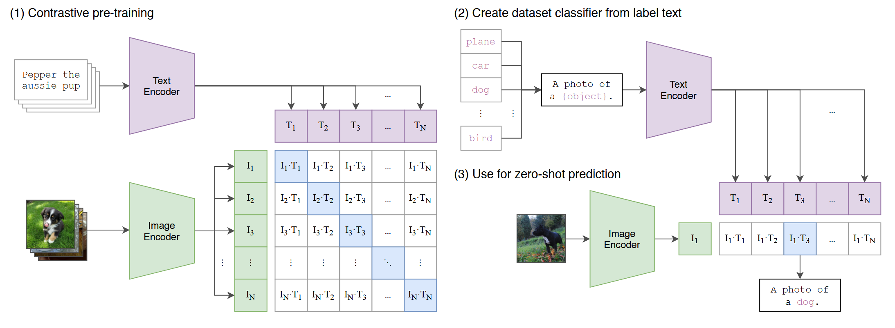

# CLIP

*Contrastive Language-Image Pre-training*(CLIP) is an efficient learning method under natural language supervision. A simple pre-training task that predicts which caption goes with which image is an efficient and scalable way to learn SOTA image representations from scratch on a dataset of 400 million (image, text) pairs collected from the internet. The key idea of CLIP is to maximize the similarities between the image features and text features in positive pairs and minimize the negative pairs. After pre-training, natural language is used to reference learned visual concepts enabling zero-shot transfer of the model to downstream tasks.

## Abstract

State-of-the-art computer vision systems are trained to predict a fixed set of predetermined object categories. This restricted form of supervision limits their generality and usability since additional labeled data is needed to specify any other visual concept. Learning directly from raw text about images is a promising alternative which leverages a much broader source of supervision. We demonstrate that the simple pre-training task of predicting which caption goes with which image is an efficient and scalable way to learn SOTA image representations from scratch on a dataset of 400 million (image, text) pairs collected from the internet. After pre-training, natural language is used to reference learned visual concepts (or describe new ones) enabling zero-shot transfer of the model to downstream tasks. We study the performance of this approach by benchmarking on over 30 different existing computer vision datasets, spanning tasks such as OCR, action recognition in videos, geo-localization, and many types of fine-grained object classification. The model transfers non-trivially to most tasks and is often competitive with a fully supervised baseline without the need for any dataset-specific training. For instance, we match the accuracy of the original ResNet-50 on ImageNet zero-shot without needing to use any of the 1.28 million training examples it was trained on. We release our code and pre-trained model weights at https://github.com/OpenAI/CLIP.

## Reference

[1] Radford, Alec, Jong Wook Kim, Chris Hallacy, Aditya Ramesh, Gabriel Goh, Sandhini Agarwal, Girish Sastry, et al. “Learning Transferable Visual Models From Natural Language Supervision.” arXiv, February 26, 2021. https://doi.org/10.48550/arXiv.2103.00020.
