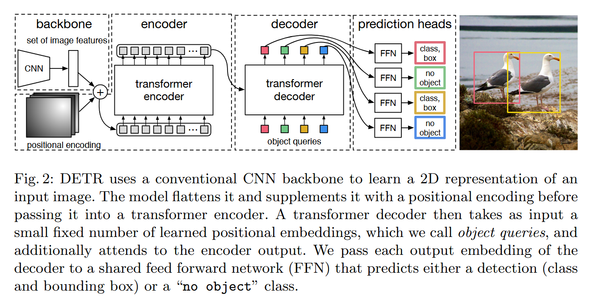

# DETR

*DEtection TRansformer*(DETR) is the first Transformer-based object detector, removing the need for many hand-designed components like non-maximum suppression. It predicts all objects at once and is trained end-to-end with a *set loss function* that performs optimal bipartite graph matching between predicted and ground truth objects. Unlike the original Transformer which decodes in an autoregressive manner, DETR performs parallel decoding. It infers a fixed-size set of N predictions in a single pass through the decoder, where N is set to significantly larger than the typical number of objects in an image.  DETR model contains three main components: (1) a CNN backbone to extract a low-resolution feature map; (2) an encoder-decoder Transformer; (3) a feed-forward network to make final detection predictions.

## Abstract

We present a new method that views object detection as a direct set prediction problem. Our approach streamlines the detection pipeline, effectively removing the need for many hand-designed components like a non-maximum suppression procedure or anchor generation that explicitly encode our prior knowledge about the task. The main ingredients of the new framework, called DEtection TRansformer or DETR, are a set-based global loss that forces unique predictions via bipartite matching, and a transformer encoder-decoder architecture. Given a fixed small set of learned object queries, DETR reasons about the relations of the objects and the global image context to directly output the final set of predictions in parallel. The new model is conceptually simple and does not require a specialized library, unlike many other modern detectors. DETR demonstrates accuracy and run-time performance on par with the well-established and highly-optimized Faster RCNN baseline on the challenging COCO object detection dataset. Moreover, DETR can be easily generalized to produce panoptic segmentation in a unified manner. We show that it significantly outperforms competitive baselines. Training code and pre-trained models are available at https://github.com/facebookresearch/detr.

## Reference

[1] Carion, Nicolas, Francisco Massa, Gabriel Synnaeve, Nicolas Usunier, Alexander Kirillov, and Sergey Zagoruyko. “End-to-End Object Detection with Transformers.” In *Computer Vision – ECCV 2020*, edited by Andrea Vedaldi, Horst Bischof, Thomas Brox, and Jan-Michael Frahm, 12346:213–29. Cham: Springer International Publishing, 2020. https://link.springer.com/10.1007/978-3-030-58452-8_13.

[2] Vaswani, Ashish, Noam Shazeer, Niki Parmar, Jakob Uszkoreit, Llion Jones, Aidan N Gomez, Ł ukasz Kaiser, and Illia Polosukhin. “Attention Is All You Need.” In *Advances in Neural Information Processing Systems*, Vol. 30. Curran Associates, Inc., 2017. https://papers.nips.cc/paper_files/paper/2017/hash/3f5ee243547dee91fbd053c1c4a845aa-Abstract.html.

