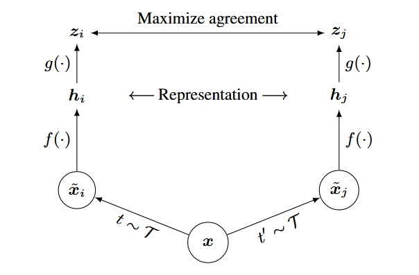

# SimCLR

*SimCLR* is a simple framework for contrastive learning of visual representations. Its main idea is to maximize the similarity of the positive example pairs and minimize the similarity of negative example pairs. The framework contains four major components: (1) a stochastic ***data augmentation module*** that randomly transforms an image in two correlated views; (2) an ***encoder*** that extracts features from augmented images; (3) a ***projection head*** that maps representations to the space where contrastive loss is applied; (4) a ***contrastive loss function*** defined for the contrastive prediction task. Three simple augmentations are applied sequentially in *SimCLR*: random cropping and resizing back to the original size, random color distortions, and random Gaussian blur. *SimCLR* measures the similarity between two images by the *cosine similarity* of their representation vectors. In practice, a projection head that maps the image representation vectors to a space where contrastive loss is applied can produce higher-quality representations.

## Abstract

This paper presents SimCLR: a simple framework for contrastive learning of visual representations. We simplify recently proposed contrastive self-supervised learning algorithms without requiring specialized architectures or a memory bank. In order to understand what enables the contrastive prediction tasks to learn useful representations, we systematically study the major components of our framework. We show that (1) the composition of data augmentations plays a critical role in defining effective predictive tasks, (2) introducing a learnable nonlinear transformation between the representation and the contrastive loss substantially improves the quality of the learned representations, and (3) contrastive learning benefits from larger batch sizes and more training steps compared to supervised learning. By combining these findings, we are able to considerably outperform previous methods for self-supervised and semi-supervised learning on ImageNet. A linear classifier trained on self-supervised representations learned by SimCLR achieves 76.5% top-1 accuracy, which is a 7% relative improvement over previous state-of-the-art, matching the performance of a supervised ResNet-50. When fine-tuned on only 1% of the labels, we achieve 85.8% top-5 accuracy, outperforming AlexNet with 100× fewer labels.

## Reference

[1] Chen, Ting, Simon Kornblith, Mohammad Norouzi, and Geoffrey Hinton. “A Simple Framework for Contrastive Learning of Visual Representations.” arXiv, July 1, 2020. https://doi.org/10.48550/arXiv.2002.05709.

