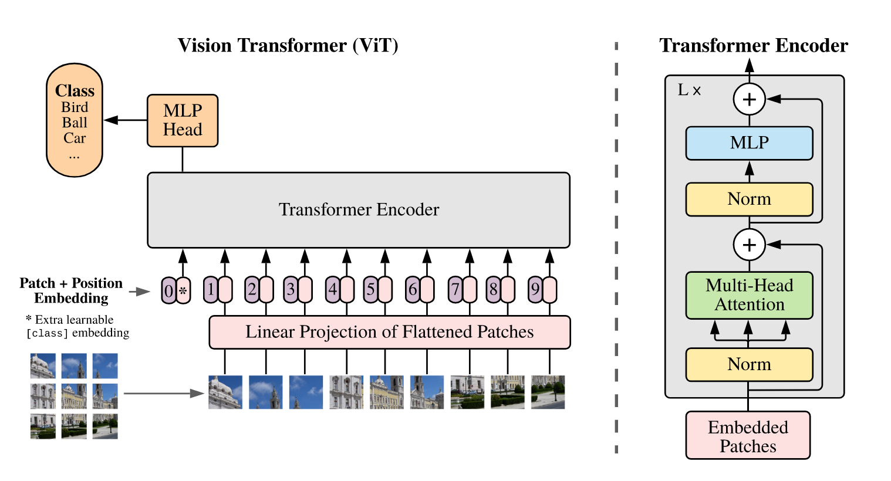

# ViT

*Vision Transformer*(ViT) is a Transformer-based vision model, which does not contain convolutional layers. *Firstly*, the image is divided into several fix-sized patches. Then the image patches are flattened into 1D vectors and mapped to $D$ dimensions with a trainable linear projection. *Secondly*, patch embeddings must be added with position embeddings to retain positional information. *Thirdly*, similar to BERT's [CLS] token, ViT prepends a learnable embedding to the sequence of embedded patches. *Finally*, the [CLS] token will be passed to the MLP head for classification after Transformer encoding.

Although ViT lacks some of the inductive biases compared to CNNs, such as translation equivariance and locality,  the large-scale training trumps inductive bias if ViT is trained on larger datasets such as *ImageNet-21k* or *JFT-300M*

## Abstract

While the Transformer architecture has become the de-facto standard for natural language processing tasks, its applications to computer vision remain limited. In vision, attention is either applied in conjunction with convolutional networks or used to replace certain components of convolutional networks while keeping their overall structure in place. We show that this reliance on CNNs is not necessary and a pure transformer applied directly to sequences of image patches can perform very well on image classification tasks. When pre-trained on large amounts of data and transferred to multiple mid-sized or small image recognition benchmarks (ImageNet, CIFAR-100, VTAB, etc.), Vision Transformer (ViT) attains excellent results compared to state-of-the-art convolutional networks while requiring substantially fewer computational resources to train.

## Reference

[1] Dosovitskiy, Alexey, Lucas Beyer, Alexander Kolesnikov, Dirk Weissenborn, Xiaohua Zhai, Thomas Unterthiner, Mostafa Dehghani, et al. “An Image Is Worth 16x16 Words: Transformers for Image Recognition at Scale.” arXiv, June 3, 2021. https://doi.org/10.48550/arXiv.2010.11929.

[2] Devlin, Jacob, Ming-Wei Chang, Kenton Lee, and Kristina Toutanova. “BERT: Pre-Training of Deep Bidirectional Transformers for Language Understanding.” arXiv, May 24, 2019. https://doi.org/10.48550/arXiv.1810.04805.